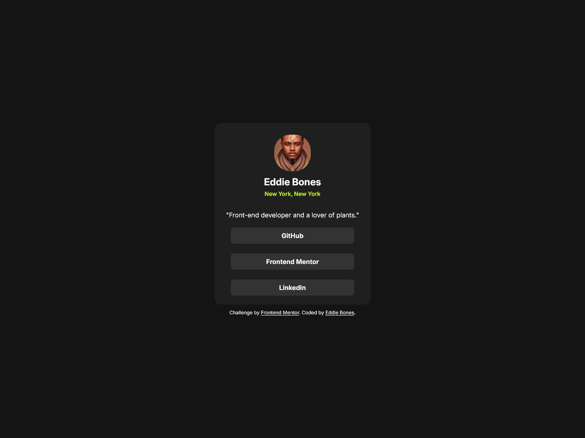
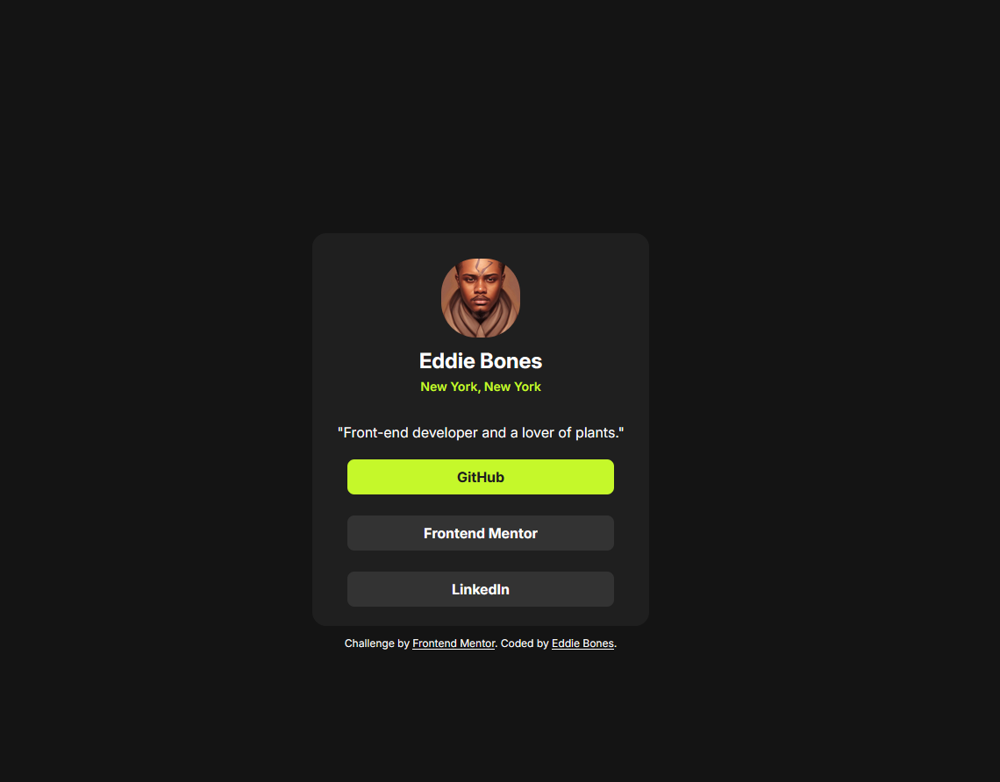

# Frontend Mentor - Social links profile solution

This is a solution to the [Social links profile challenge on Frontend Mentor](https://www.frontendmentor.io/challenges/social-links-profile-UG32l9m6dQ). Frontend Mentor challenges help you improve your coding skills by building realistic projects.

## Table of contents

- [Overview](#overview)
  - [The challenge](#the-challenge)
  - [Screenshot](#screenshot)
  - [Links](#links)
- [My process](#my-process)
  - [Built with](#built-with)
  - [What I learned](#what-i-learned)
  - [Continued development](#continued-development)
  - [Useful resources](#useful-resources)
- [Author](#author)

## Overview

### The challenge

Users should be able to:

- See hover and focus states for all interactive elements on the page

### Screenshot


#### Desktop Version



#### Active States



#### Mobile Version


### Links

- Solution URL: [Add solution URL here](https://your-solution-url.com)
- [Live Site URL:](https://eddiebones1.github.io/Social-Links-Profile/)

## My process

### Built with

- Semantic HTML5 markup
- CSS Global Properties
- CSS Pseudo-classes
- CSS Grid

### What I learned

Something that I learned while working on this project, is the use of pseudo-classes. While I was working on styling the body of the page, I noticed that the font color of the attribution was the same as the page background. So, I used the `:not{}` pseudo-class in the body of my stylesheet, so that the attribution will not be affected whenever I style the body of the page.

To see how you can add code snippets, see below:

```css
body:not(selector) {
}
```

### Continued development

Even though I didn't have access to the Figma files, the Inspect tool in Mozilla Firefox and Affinity Designer helped me A LOT when it came to developing my social link profile page. With the measurement tool in Affinity Designer, I was able to measure the width and height of the container, and the margins around the container. And with the inspect tool within Firefox, I made fine adjustments, such as the position of the elements, and making the site responsive.

### Useful resources

- [How to use the :not{} pseudo-class ](https://developer.mozilla.org/en-US/docs/Web/CSS/:not) - mdn web docs further explain the use of the ```:not{}``` pseudo-class.
- [Affinity Designer](https://bit.ly/3XDfttR) - By using the measurement tool in this application, you will be able to know the margin, and padding around certain elements.

## Author

- Website - [Add your name here](https://www.your-site.com)
- Frontend Mentor - [@EddieBones1](https://www.frontendmentor.io/profile/EddieBones1)
